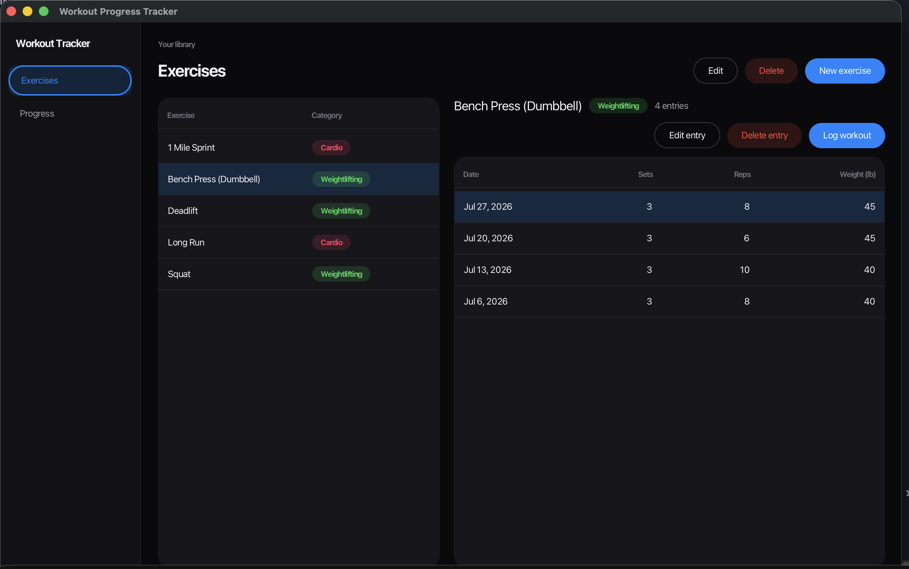
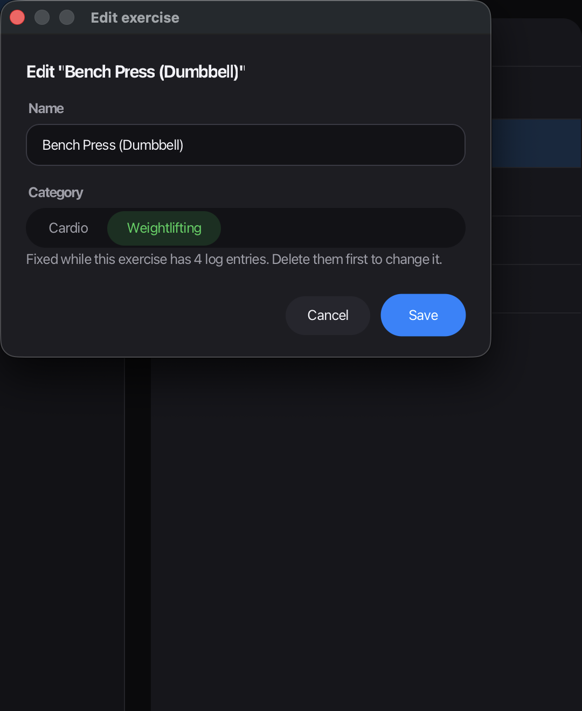
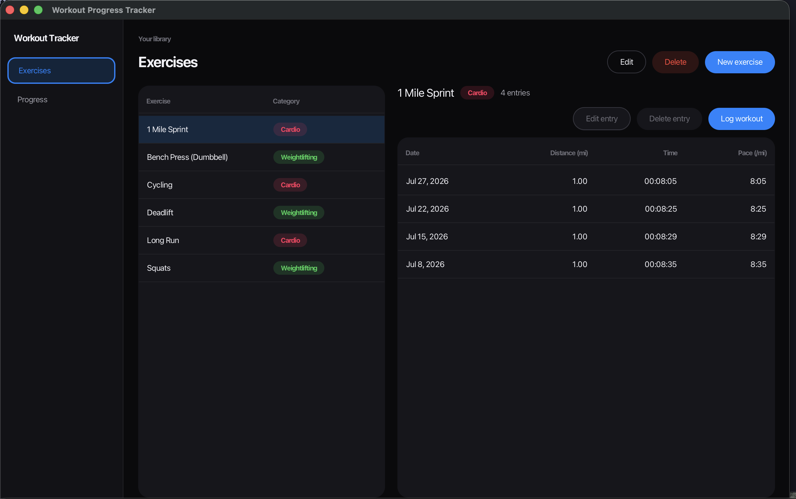
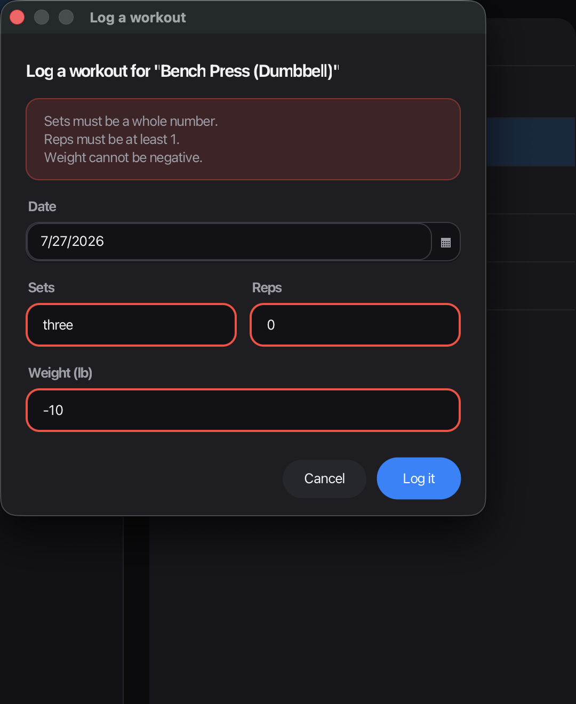
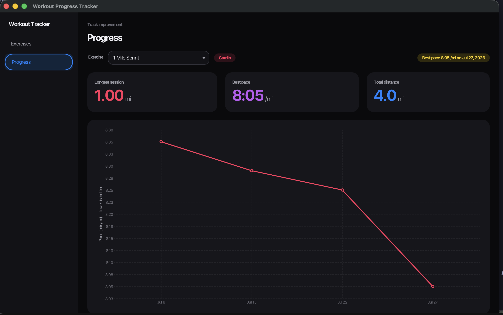

# Workout Progress Tracker

**Student:** William Schaffer

A JavaFX desktop application for logging workouts and tracking progress over
time. You define your own exercises — each one either **cardio** or
**weightlifting** — record sessions against them, and see how your numbers move.

Repository: <https://github.com/3030Will/a-fitness-tracker>



## Features

**Exercises**

- Create, rename and delete your own exercises
- Each exercise is cardio or weightlifting, chosen with a segmented control
- Names must be unique, ignoring case, so "Squat" and "squat" cannot both exist
- Deleting an exercise warns you how many logged sessions will go with it
- An exercise's category is fixed once it has entries, because the recorded
  measurements depend on it

**Logging**

- Record a session against any exercise, dated with a date picker
- Weightlifting sessions record sets, reps and weight in pounds
- Cardio sessions record distance in miles and a time typed as `mm:ss` or
  `hh:mm:ss`
- The form asks only for the measurements that apply, so a run is never
  prompted for sets and reps
- Full editing and deleting of past entries, with confirmation before a delete
- Pace is worked out for you, in minutes per mile

**Progress**

- Per-exercise records shown as large readouts: heaviest set, best session
  volume and sessions logged for lifting; longest session, best pace and total
  distance for cardio
- A personal-record badge naming the best result and its date
- A line chart of every session, oldest to newest — weight for lifting, pace
  for cardio, since a faster mile is an improvement where a longer run is
  simply a longer run

**Throughout**

- Every value is validated before it is saved, and all problems with a form
  are reported at once rather than one at a time
- Errors are shown in plain language, with the fields they concern marked
- Data is stored locally in a SQLite database and survives restarting the app

## Screenshots

Creating an exercise, and a cardio log with pace worked out per session:




Every problem with a form reported at once, and progress for a cardio
exercise charted by pace:




## Technologies Used

| Component | Choice |
|---|---|
| Language | Java 25 |
| User interface | JavaFX 25, laid out in FXML and styled with CSS |
| Build | Maven |
| Database | SQLite, via `org.xerial:sqlite-jdbc` |
| Testing | JUnit 5, with TestFX driving the interface |

## Requirements

- JDK 25 or newer
- Maven 3.9 or newer

No separate JavaFX installation is needed; Maven fetches it like any other
dependency.

## Compile and Run

Run the application:

```bash
mvn clean javafx:run
```

Build without running:

```bash
mvn clean package
```

Run the tests:

```bash
mvn test
```

The database file `workout.db` is created in the project directory the first
time the application starts, and the tables are created with it.

## Project Structure

```
src/main/java/com/workouttracker/
├── App.java          JavaFX entry point
├── model/            Exercise, Category, LogEntry, CardioEntry, LiftEntry
├── dao/              ExerciseDao, LogEntryDao — all SQL lives here
├── service/          business rules, coordinating the DAOs
├── ui/               controllers and dialogs
└── util/             Database, Validator, and the two exception types

src/main/resources/com/workouttracker/ui/   FXML layouts and app.css
src/test/java/com/workouttracker/           JUnit and TestFX tests
```

The application is layered `ui → service → dao → database`. The interface
never touches SQL, and the data access layer never mentions JavaFX.

## Design Notes

**One table for two kinds of entry.** Cardio and weightlifting sessions share
a `log_entries` table with nullable columns for each. They are read back as an
abstract `LogEntry` with `CardioEntry` and `LiftEntry` subclasses, and the DAO
picks the subclass from the parent exercise's category. Each subclass knows
how to describe and measure itself, so the interface can render either without
asking which it has.

**Rules live where they can be enforced.** The database constrains what it can
— unique names, a valid category, and a cascade so entries never outlive their
exercise. Rules provable from the input alone live in `Validator`. Rules
needing to look something up — is this name taken, does this entry suit its
exercise — live in the service layer.

## Testing

162 tests run under `mvn test`. Most cover the database, validation and
business rules directly. The rest drive the real interface with TestFX,
clicking buttons and typing into forms, so that "every control works" is
something the build checks rather than something the author asserts. They run
offscreen and do not take over the display.
